# 🎨 CSS Grid Layout — Pemrograman Web 1

## 📖 Deskripsi

Project ini merupakan kumpulan hasil latihan praktikum Pertemuan 10 mata kuliah Pemrograman Web 1, Program Studi Teknologi Rekayasa Perangkat Lunak (TRPL). Berisi 16 file HTML mandiri yang masing-masing menerapkan CSS Grid untuk membangun layout web bertema industri nyata, mulai dari katalog produk, admin dashboard, kanban board, hingga capstone dashboard akademik.

## 🎯 Tujuan

Tujuan dari project ini adalah untuk memahami dan menerapkan CSS Grid, seperti:

- Membangun layout dua dimensi menggunakan `display: grid`
- Menggunakan `grid-template-columns`, `grid-template-rows`, dan `grid-template-areas`
- Membuat layout responsif dengan `repeat()`, `auto-fit`, dan `minmax()`
- Mengatur penempatan elemen dengan grid lines dan `span`
- Memahami fitur modern CSS Grid seperti `subgrid` dan container queries
- Menguji tampilan pada ukuran desktop, tablet, dan mobile

## ✨ Fitur

- 16 file HTML mandiri, masing-masing langsung bisa dibuka di browser
- Setiap halaman bertema skenario industri nyata
- Layout responsif tanpa framework CSS
- Mencakup CSS Grid dasar hingga lanjutan (subgrid, container query)

## 📄 Halaman yang Dibuat

| File | Topik |
|------|-------|
| `latihan01.html` | Product Catalog Responsive Grid |
| `latihan02.html` | Pricing Plan SaaS |
| `latihan03.html` | Admin Dashboard dengan Grid Areas |
| `latihan04.html` | E-Commerce Listing + Filter Sidebar |
| `latihan05.html` | KPI Card Grid untuk Executive Dashboard |
| `latihan06.html` | News Portal / Magazine Layout |
| `latihan07.html` | LMS Course Dashboard |
| `latihan08.html` | Checkout Page: Form + Order Summary |
| `latihan09.html` | Gallery Portfolio Auto Placement |
| `latihan10.html` | Kanban Board Project Management |
| `latihan11.html` | Grid Line Placement untuk Hero Landing Page |
| `latihan12.html` | Subgrid untuk Alignment Card Lanjutan |
| `latihan13.html` | Container Query untuk Komponen Card Modern |
| `latihan14.html` | Semantic Responsive Landing Page |
| `latihan15.html` | Bootstrap-like 12 Column Grid System |
| `latihan16.html` | Capstone: Dashboard Akademik TRPL |

## 🛠️ Teknologi yang Digunakan

- HTML
- CSS (CSS Grid, Media Query, Container Query)

## 🚀 Cara Menjalankan

1. Download atau clone repository ini
2. Buka salah satu file HTML di browser, seperti:
   - `latihan01.html`
   - `latihan03.html`
   - `latihan16.html`
3. Halaman akan langsung ditampilkan tanpa perlu server atau instalasi tambahan

## 📷 Screenshots

### 📌 Latihan 01 — Product Catalog Grid
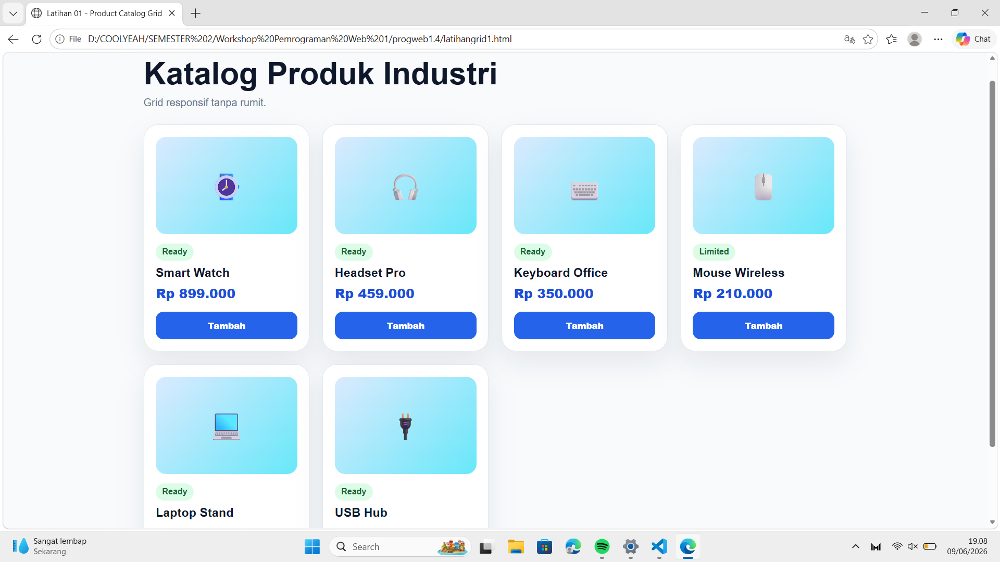

### 📌 Latihan 02 — Pricing Plan SaaS
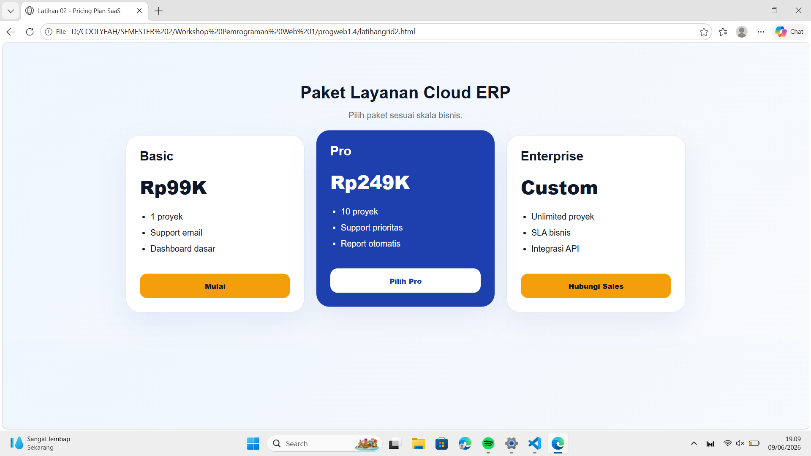

### 📌 Latihan 03 — Admin Dashboard
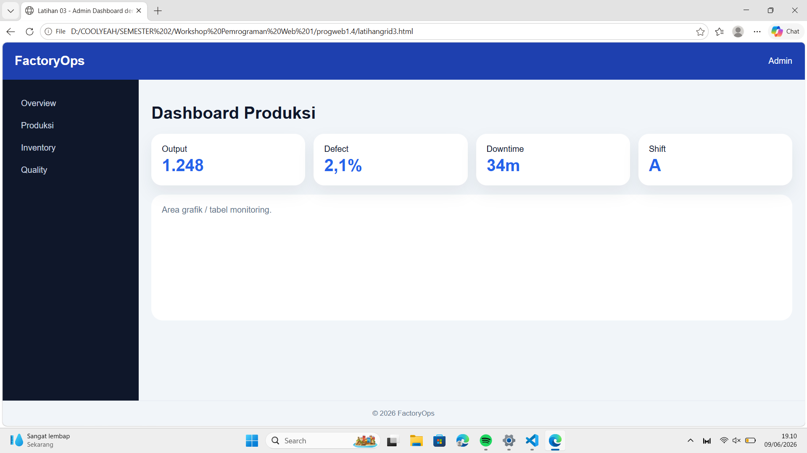

### 📌 Latihan 04 — E-Commerce Listing + Filter Sidebar
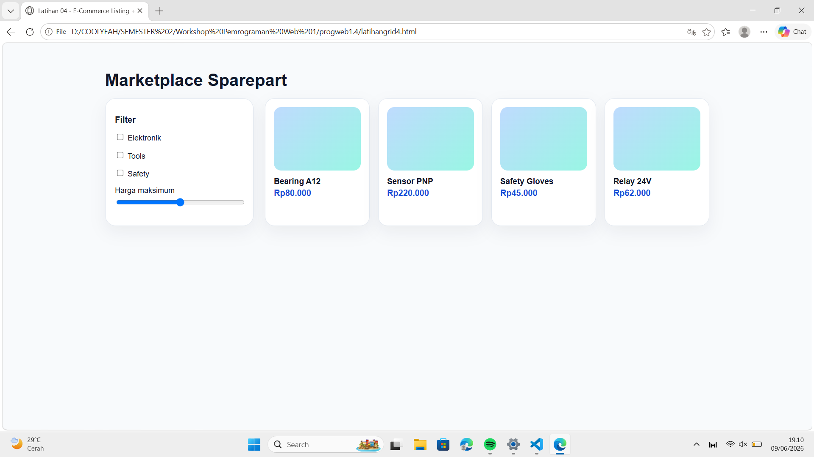

### 📌 Latihan 05 — KPI Card Grid
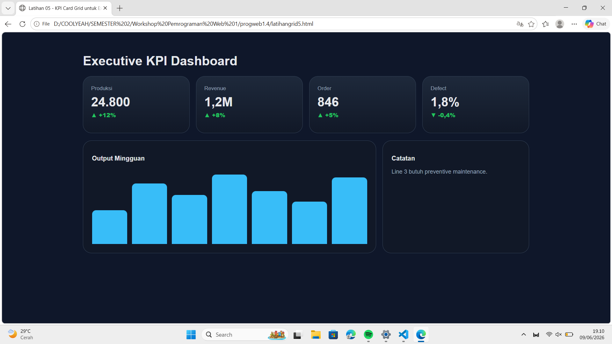

### 📌 Latihan 06 — News Portal
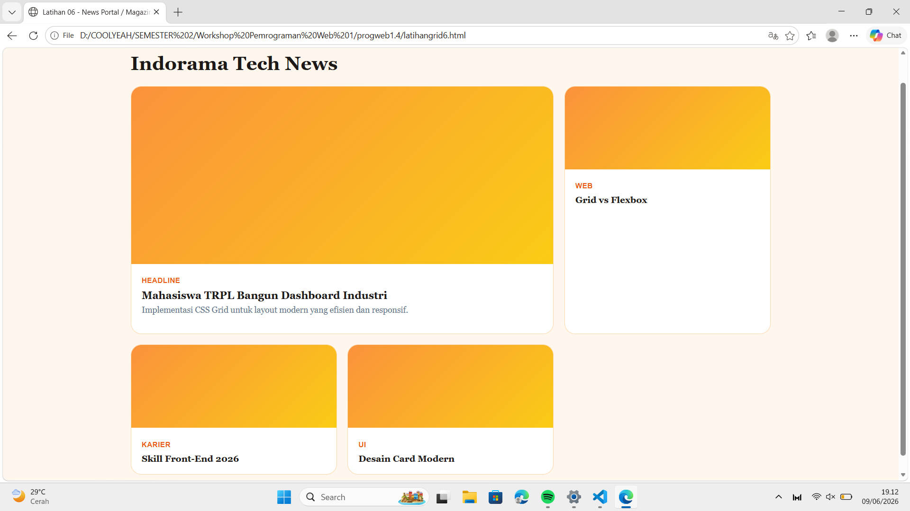

### 📌 Latihan 07 — LMS Course Dashboard
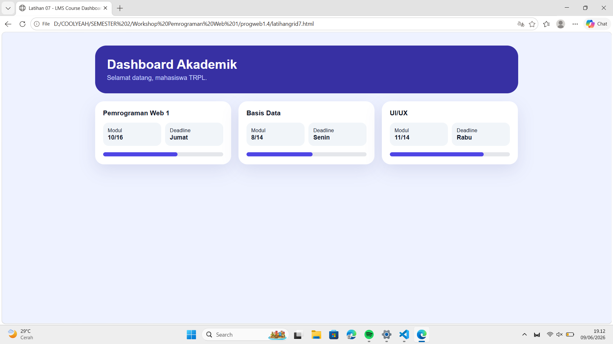

### 📌 Latihan 08 — Checkout Page: Form + Order Summary
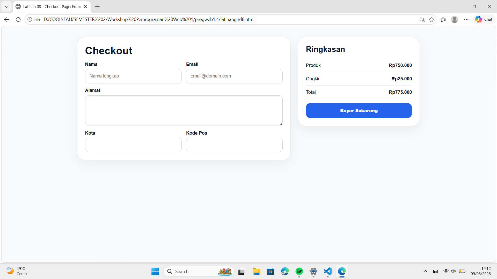

### 📌 Latihan 09 — Gallery Portfolio Auto Placement
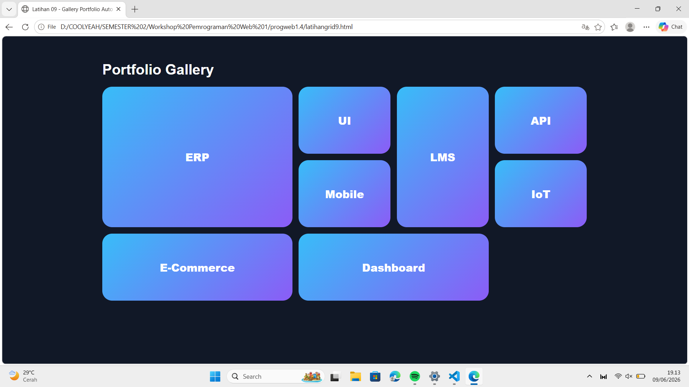

### 📌 Latihan 10 — Kanban Board
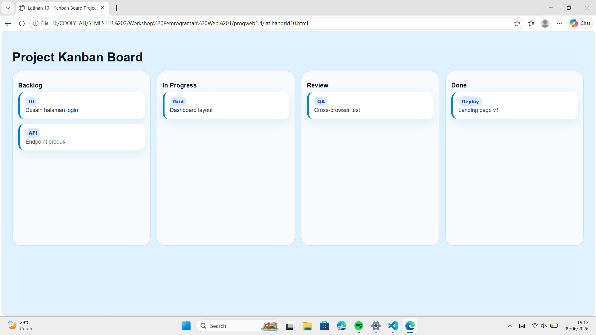

### 📌 Latihan 11 — Grid Line Placement
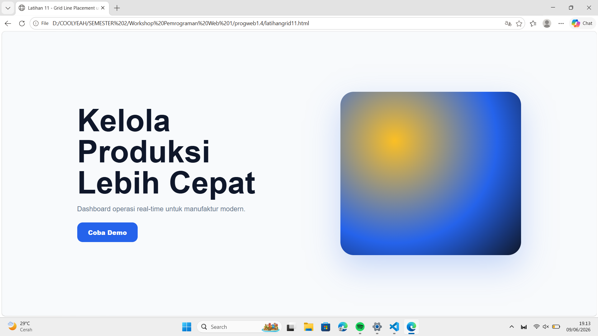

### 📌 Latihan 12 — Subgrid
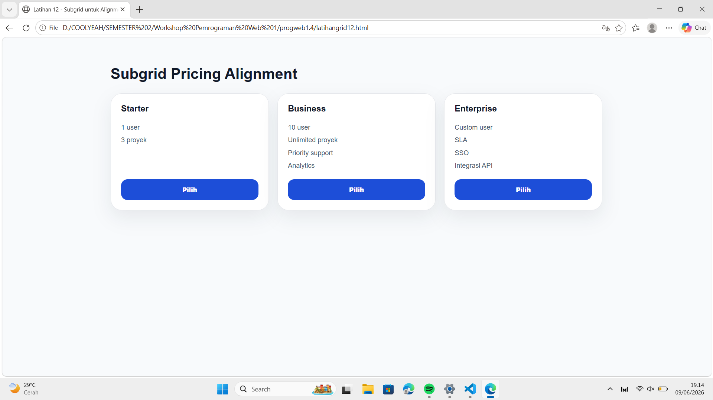

### 📌 Latihan 13 — Container Query
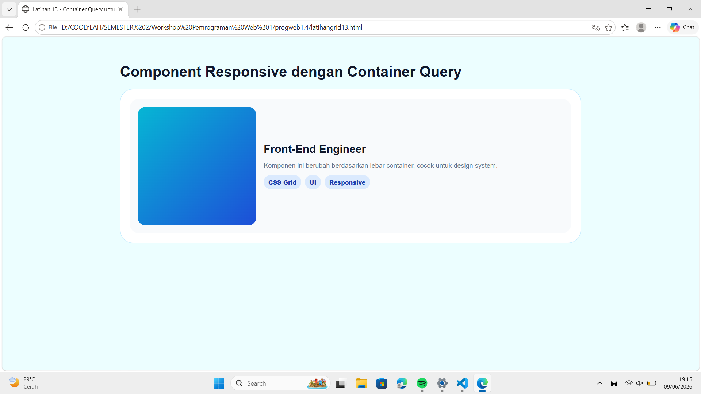

### 📌 Latihan 14 — Semantic Responsive Landing Page
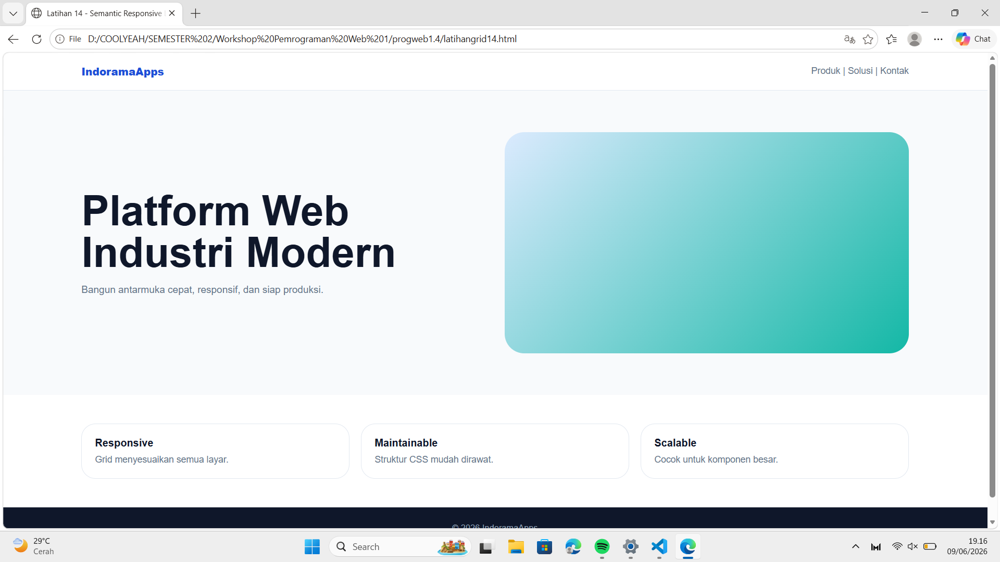

### 📌 Latihan 15 — Bootstrap-like 12 Column Grid System
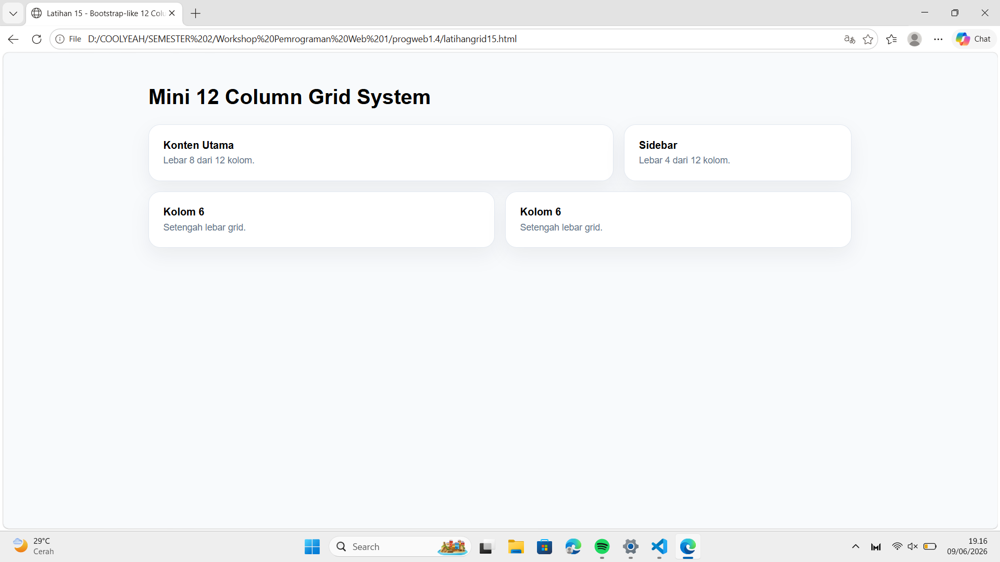

### 📌 Latihan 16 — Capstone Dashboard Akademik TRPL
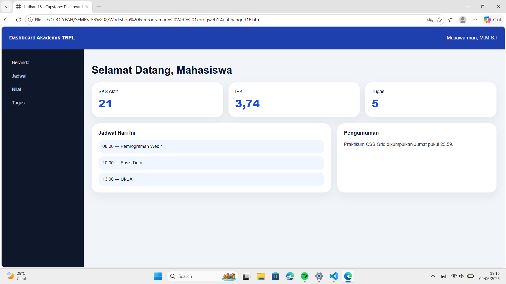

---

**Mata Kuliah:** Workshop Pemrograman Web 1   
**Program Studi:** Teknologi Rekayasa Perangkat Lunak  
**Institusi:** Politeknik Enjinering Indorama
